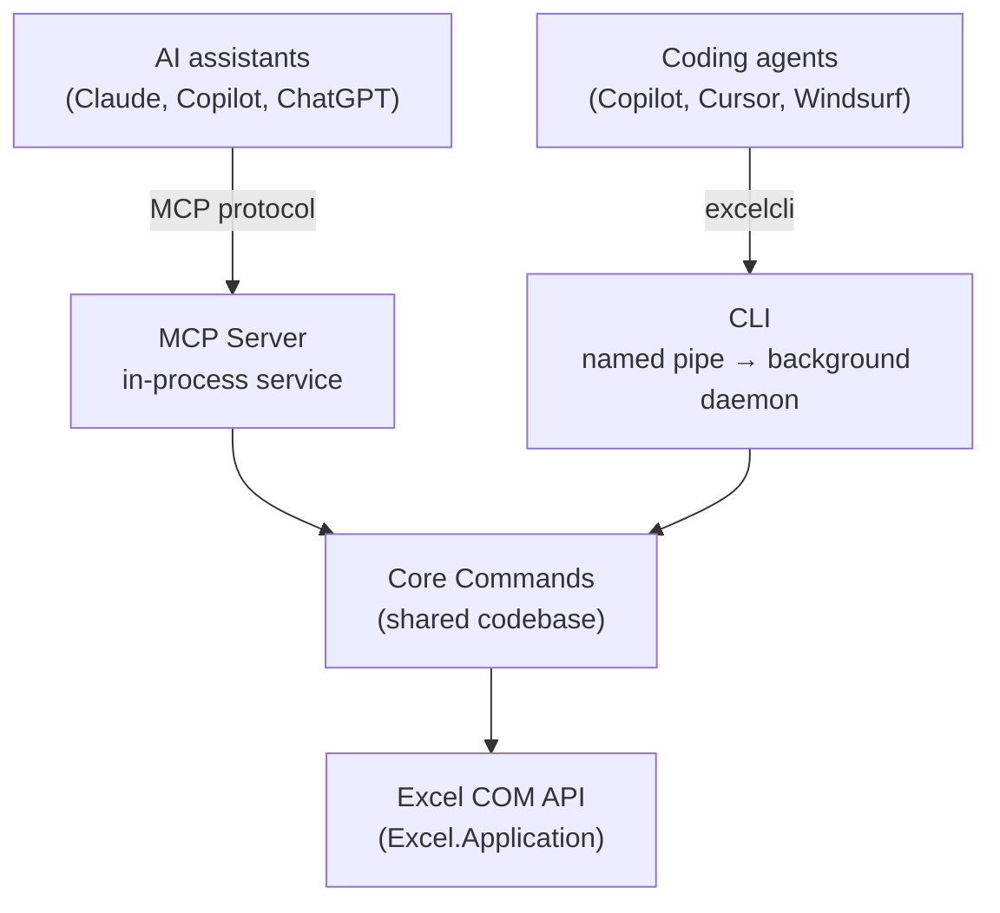

# Architecture

**Excel MCP Server uses Windows COM automation to control the actual Excel
application — not just `.xlsx` files.** Because it drives Excel's official COM
API (`Excel.Application`), it can run live Excel operations — refresh Power
Query, recalculate, refresh PivotTables and the Data Model, evaluate DAX, and run
VBA or Python `=PY()` — and edit your existing workbooks with formulas,
PivotTables, charts and macros left intact. You can watch Excel update in real
time as the AI works.

## Two equal entry points

The project ships **both** an MCP Server and a CLI. They are first-class,
interchangeable entry points that share the same core, so every operation
behaves identically no matter which you use:

- **MCP Server** hosts the service **in-process** — direct method calls, no
  pipe — which suits conversational, interactive AI clients.
- **CLI** (`excelcli`) talks to a **background daemon** over a named pipe, so
  sessions persist across invocations — ideal for scripted, high-throughput
  automation by coding agents.

## Shared core, separate processes

Both entry points build on the same **Core Commands** codebase, so a feature
added to one is automatically available to the other with the same parameters,
defaults and validation. They run as **separate processes**, each managing its
own Excel instance, and do **not** share live sessions with each other.

Ready to install? See the [installation guide](installation.md), or dive into
the [MCP Server](mcp-server.md) and [CLI](cli.md) references.
