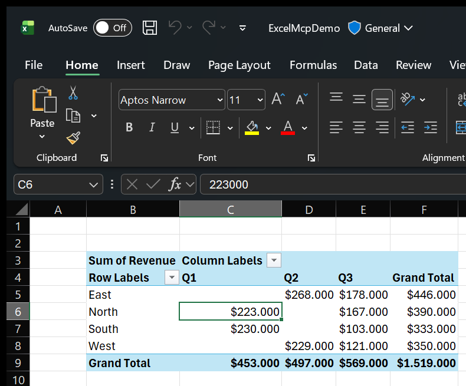

# Complete Feature Reference

<figure markdown="span">
  { width="620" loading=lazy }
  <figcaption>A PivotTable — revenue by region and quarter with grand totals — created in the real Excel application from a plain-language request.</figcaption>
</figure>

--8<-- "_generated/features.md"
