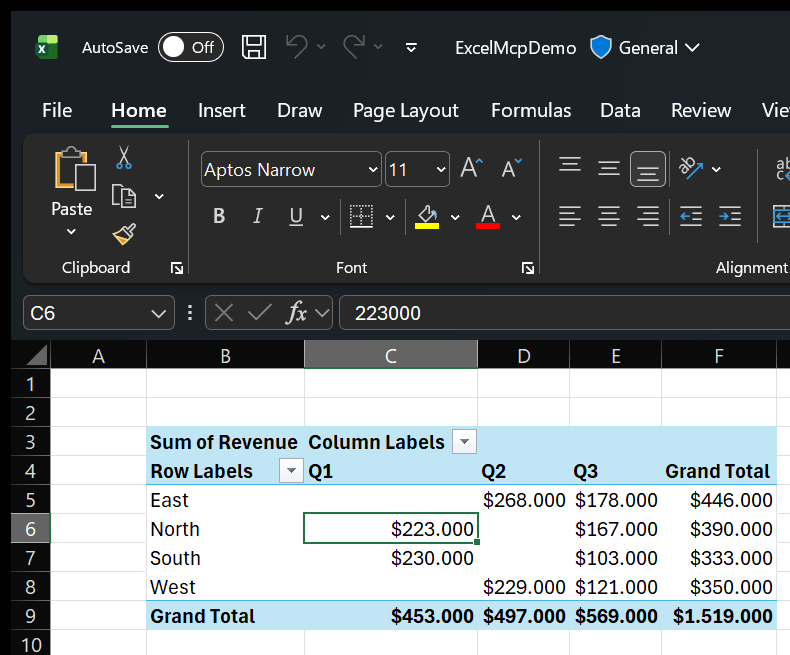

# Excel Automation Features

<figure markdown="span">
  { width="790" height="655" loading=lazy }
  <figcaption>A PivotTable — revenue by region and quarter with grand totals — created in the real Excel application from a plain-language request.</figcaption>
</figure>

Excel MCP Server provides **31 specialized tools and 325 operations** for
automating the real Microsoft Excel application. You can ask your AI assistant
in plain language—the reference pages below are for discovering what is
possible and looking up individual operations.

-   :material-database-arrow-down:{ .lg .middle } **Data & analytics**

    ---

    Import and reshape data with Power Query, build DAX models, create Excel
    Tables and PivotTables, and manage external connections.

    **Includes:** Power Query, Data Model, Excel Tables, PivotTables,
    Data Connections, QueryTables

    [Explore data and analytics features :material-arrow-right:](features/data-analytics.md)

-   :material-table-large:{ .lg .middle } **Cells & workbooks**

    ---

    Read and write ranges, formulas, and formats; manage worksheets, workbook
    settings, named ranges, calculation, and files.

    **Includes:** File Operations, Calculation, Ranges, Worksheets, Workbook,
    Named Ranges

    [Explore cells and workbook features :material-arrow-right:](features/cells-workbooks.md)

-   :material-chart-box-outline:{ .lg .middle } **Charts & visuals**

    ---

    Turn workbook data into charts, slicers, conditional formatting,
    screenshots, drawings, and sparklines.

    **Includes:** Charts, Slicers, Conditional Formatting, Screenshots,
    Drawing Objects, Sparklines

    [Explore chart and visual features :material-arrow-right:](features/charts-visuals.md)

-   :material-robot-outline:{ .lg .middle } **Automation & advanced**

    ---

    Run VBA and Python, control Excel windows, solve What-If scenarios, and
    work with XML Maps.

    **Includes:** VBA, Python in Excel, Window Management, What-If Analysis,
    XML Maps

    [Explore automation and advanced features :material-arrow-right:](features/automation-advanced.md)

## Popular capabilities

| What you want to do | Feature reference |
|---|---|
| Import or transform data | [Power Query](features/data-analytics.md#power-query-m-code) |
| Build a Power Pivot model | [Data Model & DAX](features/data-analytics.md#data-model-dax-power-pivot) |
| Create a PivotTable | [PivotTables](features/data-analytics.md#pivottables) |
| Read, write, or format cells | [Ranges](features/cells-workbooks.md#ranges) |
| Create a chart | [Charts](features/charts-visuals.md#charts) |
| Run a macro | [VBA Macros](features/automation-advanced.md#vba-macros) |
| Find an input for a target result | [What-If Analysis](features/automation-advanced.md#what-if-analysis) |

!!! tip "You do not need to memorize operation names"
    Describe the Excel result you want. Your AI assistant selects the appropriate
    tool and operation from the reference automatically.
