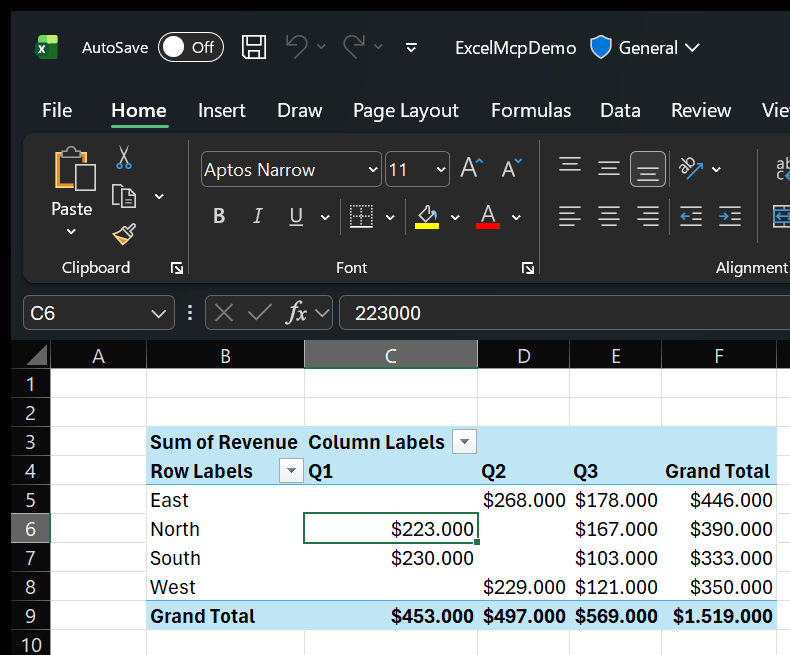

# Excel Automation Features

<figure markdown="span">
  { width="790" height="655" loading=lazy }
  <figcaption>Windows demonstration: a PivotTable — revenue by region and quarter with grand totals — created in the real Excel application from a plain-language request.</figcaption>
</figure>

--8<-- "_generated/features.md"
