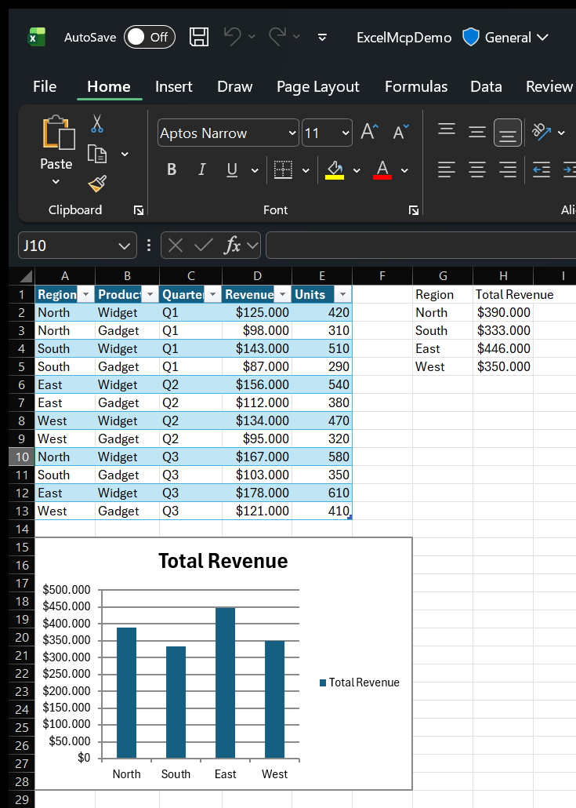
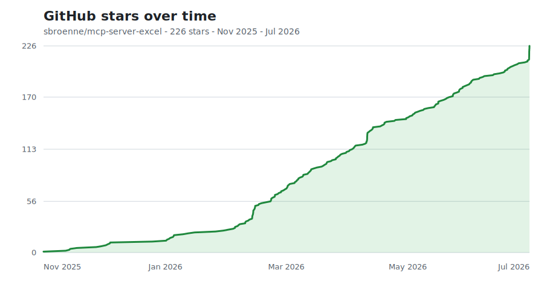

!!! success "Powered by the real Excel engine"
    Excel MCP Server automates the **actual Excel application** through its
    official COM API — the same engine Excel itself uses. That unlocks what
    spreadsheets are really for:

    - **Runs live Excel operations.** Refresh Power Query to pull and reshape
      fresh data, recalculate with Excel's own engine, refresh PivotTables and
      the Data Model, evaluate DAX, and run VBA or Python `=PY()` — the real,
      *computed results* land right in your workbook.
    - **Edits your existing files safely.** Excel opens and saves the workbook
      itself, so every formula, PivotTable, chart, macro, the Data Model and all
      your formatting stay exactly as they were.

    Other tools (openpyxl-based MCP servers and Agent Skills, including
    Anthropic's `xlsx` skill) read and rewrite the `.xlsx` file directly — which
    can quietly drop PivotTables, charts, and macros, and can't run Power Query,
    the Data Model, or DAX at all. Here, Excel does the work. Watch it live: just
    say *"Show me Excel while you work."*

[{ width="560" }](https://youtu.be/B6eIQ5BIbNc)

▶️ [Watch the intro video (1 min)](https://youtu.be/B6eIQ5BIbNc)

!!! tip "Also building PowerPoint decks?"
    Check out [PowerPoint MCP Server](https://powerpointmcpserver.dev/) — the
    sister project, built the same way.

## Key features

-   :material-transit-connection-variant:{ .lg .middle } __Power Query &amp; M code__

    ---

    Create, edit and optimize M code. Import from files, databases and APIs.
    Refresh queries and manage load destinations.

-   :material-calculator-variant:{ .lg .middle } __Power Pivot &amp; DAX__

    ---

    Build Data Models, create DAX measures and manage table relationships.
    Full Power Pivot automation.

-   :material-chart-box:{ .lg .middle } __PivotTables &amp; charts__

    ---

    Create PivotTables from ranges, tables or the Data Model. Build charts and
    PivotCharts with full formatting control.

-   :material-table:{ .lg .middle } __Tables &amp; ranges__

    ---

    Read/write data, formulas and formatting. Filter, sort and validate. Manage
    Excel Tables with structured references.

-   :material-code-braces:{ .lg .middle } __VBA macros__

    ---

    View, import, update and execute VBA code. Export modules for version
    control.

-   :material-file-table-box-multiple:{ .lg .middle } __Worksheets &amp; connections__

    ---

    Manage sheets, named ranges and data connections. Copy and move sheets
    between workbooks.

-   :material-eye-outline:{ .lg .middle } __Agent mode__

    ---

    Watch AI work in Excel in real time — side-by-side view, live status-bar
    feedback and smart window arrangement, like a pair programmer in a
    spreadsheet.

-   :fontawesome-brands-python:{ .lg .middle } __Python in Excel__

    ---

    Write and run `=PY()` formulas that execute in Excel's cloud Python engine —
    process worksheet data with pandas, NumPy and more, from your AI assistant.

-   :material-test-tube:{ .lg .middle } __LLM-tested quality__

    ---

    Tool behavior validated with real LLM workflows, so AI assistants reliably
    understand and use every operation.

[See all 26 tools and 232 operations :material-arrow-right:](features.md){ .md-button .md-button--primary }

## See it in action

Ask your AI assistant in plain language — it drives Excel for you:

<figure markdown="span">
  { width="440" loading=lazy }
  <figcaption>A styled Excel Table, a regional revenue summary and a column chart — created end-to-end in the real Excel application. No manual clicking, no rewriting the <code>.xlsx</code> file.</figcaption>
</figure>

!!! example "📝 Create &amp; populate data"
    **You:** "Create a new Excel file with a table for tracking sales — include
    Date, Product, Quantity, Unit Price and Total with sample data and formulas."

    The AI creates the workbook, adds headers, enters sample data and builds
    formulas automatically.

!!! example "📊 PivotTables &amp; charts"
    **You:** "Create a PivotTable showing total sales by Product, then add a bar
    chart to visualize the results."

    The AI creates the PivotTable with proper field configuration and adds a
    linked chart.

!!! example "🔄 Power Query &amp; Data Model"
    **You:** "Use Power Query to import products.csv, load it to the Data Model,
    and create measures for Total Revenue and Average Rating."

    The AI imports the data, adds it to Power Pivot and creates DAX measures
    ready for analysis.

!!! example "🎨 Formatting &amp; tables"
    **You:** "Format the Price column as currency, highlight values over $500 in
    green, and convert this to an Excel Table."

    The AI applies number formats, conditional styling, auto-fit and structured
    table styling.

## CLI or MCP Server?

This package ships **both** a CLI and an MCP Server. They share the same core,
so every operation behaves identically — pick the entry point that fits your
workflow:

| Interface | Best for | Why |
|-----------|----------|-----|
| **CLI** (`excelcli`) | Coding agents (Copilot, Cursor, Windsurf) | **64% fewer tokens** — single tool, no large schemas. Better for cost-sensitive, high-throughput automation. |
| **MCP Server** | Conversational AI (Claude Desktop, VS Code Chat) | Rich tool discovery and a persistent connection. Better for interactive, exploratory workflows. |

[MCP Server docs](mcp-server.md){ .md-button } [CLI docs](cli.md){ .md-button }

## GitHub star history

{ loading=lazy }

Updated daily from GitHub's stargazer data.
